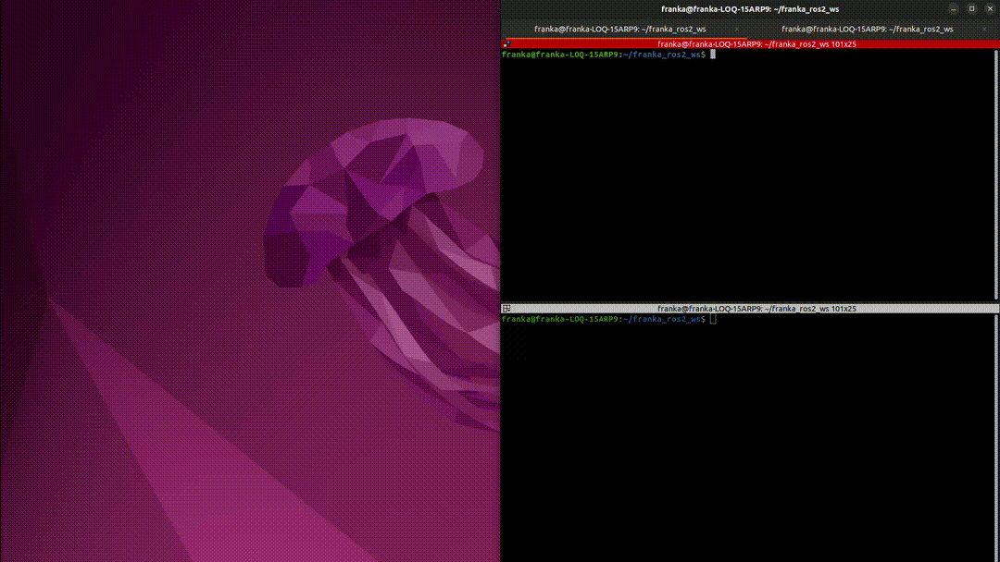
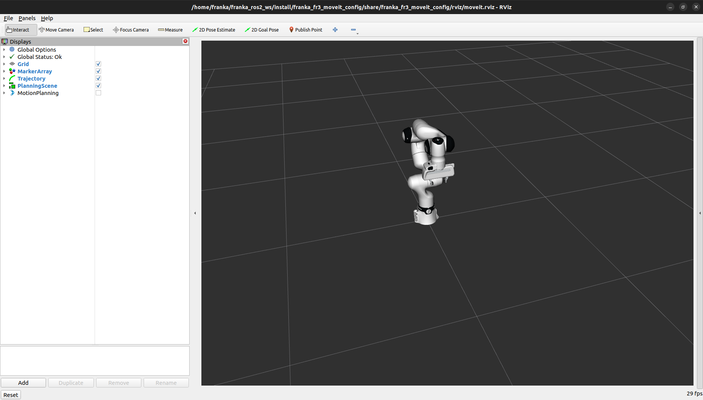
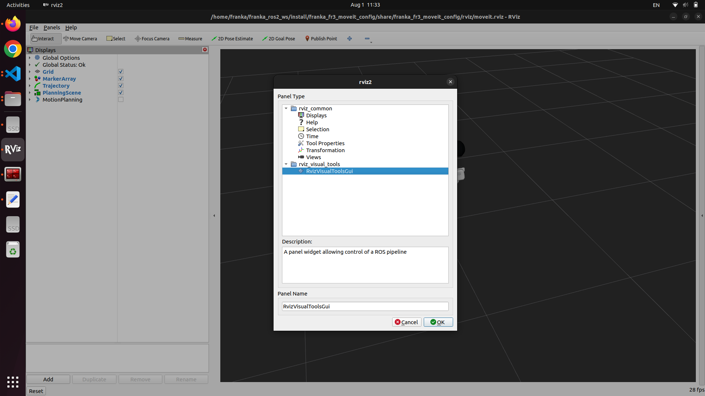
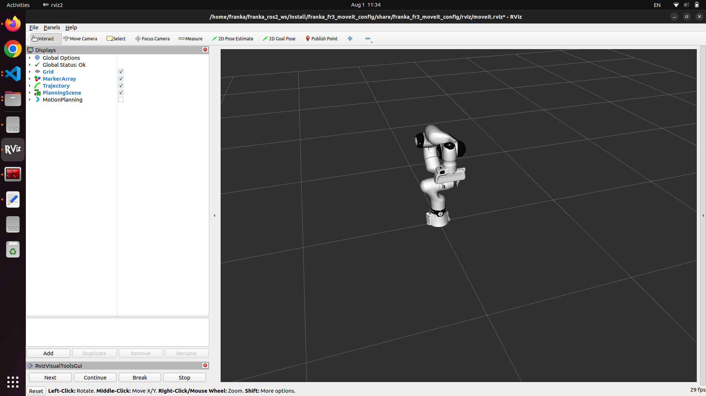
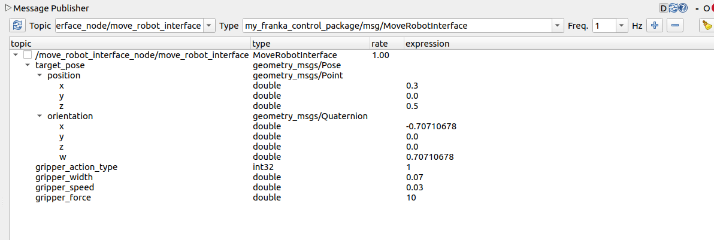

# README

|  |  |
|----------------------------------|--------------------------------------------|

## 목차
- [README](#readme)
  - [목차](#목차)
  - [Setup](#setup)
  - [Details](#details)

## Setup

본 패키지는 아래 환경에서 테스트 되었습니다.
- ROS2 distro: humble
- Ubuntu version: 22.04
- Ubuntu kernel: 5.15.0-1089-realtime

1. Franka setup
    - [Franka documentation](https://frankarobotics.github.io/docs/installation_linux.html)을 따라 기본 환경을 세팅합니다.

2. Download this package
    
    워크스페이스의 src 디렉토리 아래에 패키지 다운로드
    
    ```bash
    cd ~/franka_ros2_ws/src
    mv -r /path/to/download/dir/franka_control_package .
    ```
    
3. Install dependencies
    
    의존하고 있는 패키지를 다운로드 합니다.
    
    ```bash
    rosdep install -i --from-path src --rosdistro humble -y
    ```
    
4. Build
    
    패키지를 빌드합니다.
    
    ```bash
    cd ~/franka_ros2_ws
    colcon build  # --packages-select franka_control_package
    source install/setup.bash
    ```
    
5. Launch
    
    패키지를 실행합니다.
    
    ```bash
    # Terminal 1
    ros2 launch franka_control_package franka_control.launch.py robot_ip:=<robot-ip>
    
    # Terminal 2
    ros2 run franka_control_package move_robot_interface_node.py --ros-args -p use_gripper:=true
    ```
    
6. Operate

    - Rviz setup

        Panels > Add New Panel

        

        

        


    - Publish topic

        ```bash
        # Terminal 3
        rqt
        ```
        
        
        
        1. rqt Plugins > Topics > Message Publisher

        2. Topic: `/move_robot_interface_node/move_robot_interface` 추가

        2. topic 우클릭 > 'Publish Selected Once'
    
    - Plan & execute

        rviz 좌측 하단 'Next' 버튼 클릭할 때마다 plan, execute 수행

## Details

- **move_robot_interface_node.py**
    - 로봇 움직임에 대한 topic을 받고, robot arm, gripper 각각에 대한 action server에 동작 수행을 요청하는 노드
    - arm 동작이 완료된 후에 gripper 동작 수행
    - Subscription
        - `~/move_robot_interface` topic
    - Action client
        - `/franka_gripper/[grasp, homing, move]`
        - `move_robot_action`
- **move_robot.cpp**
    - robot arm에 대한 명령을 처리하는 노드
    - target_pose
    - Action server
        - `move_robot_action`
- Messages
    - Topic: `~/move_robot_interface`
    - Message interface
        
        ```
        geometry_msgs/Pose target_pose
        int32 gripper_action_type
        float64 gripper_width  # [m]
        float64 gripper_speed  # [m/s]
        float64 gripper_force  # [N]
        
        # Action types
        int32 NONE = 0
        int32 GRASP = 1
        int32 HOMING = 2
        int32 MOVE = 3
        ```
        
        - target_pose: eef (franka hand link)의 목적지 pose
        - gripper_action_type: gripper 조작 타입
            - [franka_gripper example](https://frankarobotics.github.io/docs/franka_ros2.html#franka-gripper) 참조
            - 0 (NONE): gripper 조작하지 않음
            - 1 (GRASP): gripper를 gripper_width만큼 이동
                - gripper_width, gripper_speed, gripper_force 모두 사용
            - 2 (HOMING): gripper를 닫은 후 다시 여는 동작
            - 3 (MOVE):
                - gripper_width, gripper_speed 사용
- Actions
    - action: `move_robot_action`
    - Action interface
        
        ```bash
        # Goal
        int32 action_type
        geometry_msgs/Pose target_pose
        
        # Action types
        int32 PLAN_ONLY = 0
        int32 EXECUTE_ONLY = 1  
        int32 PLAN_AND_EXECUTE = 2
        
        ---
        # Result
        bool success
        string message
        
        ---
        # Feedback
        string current_status
        ```
        
        - action_type: action 조작 타입
            - 0 (PLAN_ONLY): 로봇 팔을 조작하지 않고 target_pose에 대한 plan만 수행
            - 1 (EXECUTE_ONLY): plan을 수행하지 않고 직전 plan에 대한 조작 실행
            - 2 (PLAN_AND_EXECUTE): target_pose에 대해 plan을 수행하고 로봇 팔 조작
        - target_pose: eef (franka hand link)의 목적지 pose