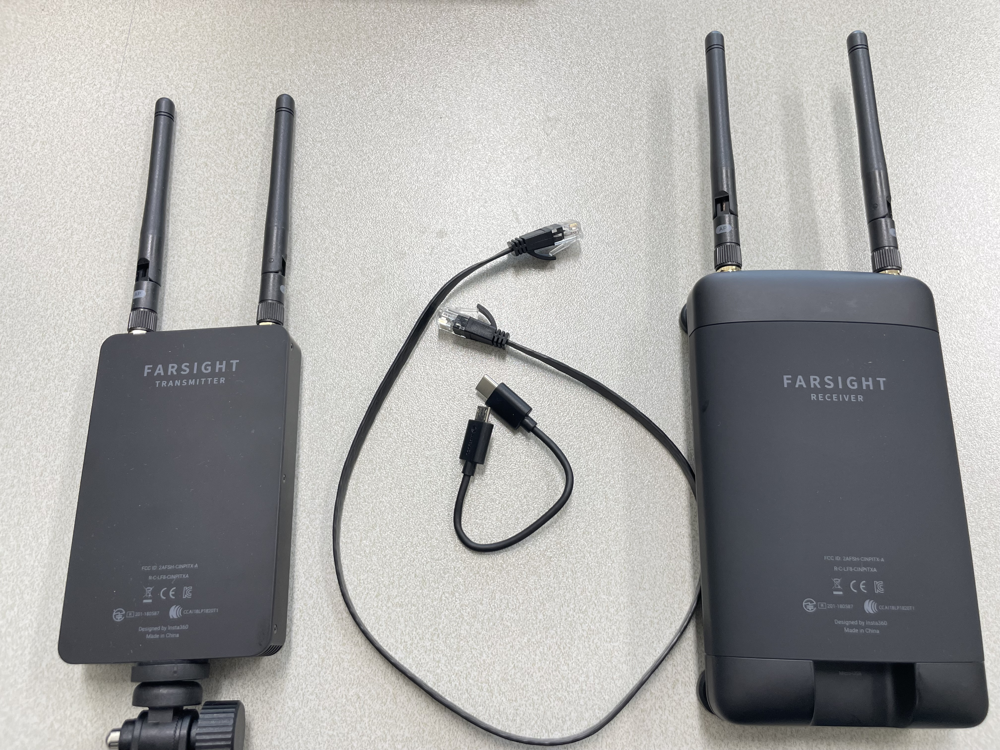

Insta 360 pro 2 
================

This manual is ``Insta 360 pro2`` device setting 
and connect to ``Insta 360 pro2 viewer``

Acknowledgement
---------------

* The official manual on [youtube](https://www.youtube.com/watch?v=mnjheVFcMq4&list=PLMfJuQCwKsWc62_yii58ZjNtr8czfdJWQ) 

* The official [site](https://www.insta360.com/kr/product/insta360-pro2)

Device environment
------------------
* Window 11 

Fisrt Step
-----------

  
  
  

1. setup ``Insta 360 pro2`` and ``battery``
2. Open battery socket in Insta 360 pro2 and input battery
3. Close battery socket cover 
* We can use 50 minutes in wireless mode 
* Power cable need a ``adapter plug`` that changes from 110v to 220v 

Firmware Update
---------------

  
  

1. Download the lasets frimware [here](https://www.insta360.com/kr/download/insta360-pro2)
2. Move ``Insta360_Pro2_Update.bin`` to SD card
3. Insert SD card to slot ``under the battery socket``
4. Restart Insta 360 pro 2 

Wireless connection
-------------------

  
  

1. Download ``Insta360 Pro/Pro2 Controller App`` in App store 
2. Click under gear button and set Ethernet mode to ``DHCP mode``

  

3. Use Insta 360 pro2 ``Hotspot``. The default password is ``88888888``

  
  
  

4. Click ``Insta360 Pro/Pro2 Controller App`` and select ``Connection Method B``
5. Click ``Photo`` button. If you insert 6 micro sd cards then you can take pictures. 

Ethernet connection
-------------------

  
  

1. Download ``Insta 360 Pro`` program [here](https://www.insta360.com/kr/download/insta360-pro2)
2. Click under gear button and set Ethernet mode to ``Direct mode``

  

3. Insert ``LAN cable`` into the device. (If battery is low, connect the dc charger)

  
  
  

4. Set static IP. Go to ``Window settings`` and ``Network & internet``. Change IPv4 address ``192.168.1.100`` and Subnet mask ``255.255.255.0``  

  

5. Click ``Insta 360 Pro`` program and input ``192.168.1.188`` (this address is on the insta 360 screen)

  

6. Then we can see preview 

Connecting Farsight to device 
------------------------------

  

1. Setup ``farsight transmitter``, ``farsight receiver``, ``Short LAN cable`` and ``usb 5 pin to C or Lightening``  
* Transmitter and recevier use internal battery. Please charge them. 

2. Set Ethernet mode to ``Direct mode``

  
  

3. Download ``Insta 360 pro`` and click ``Connection Method A``
4. Input ``192.168.100.xxx`` (this address is on the insta 360 screen) 

  

5. We can see preview 
